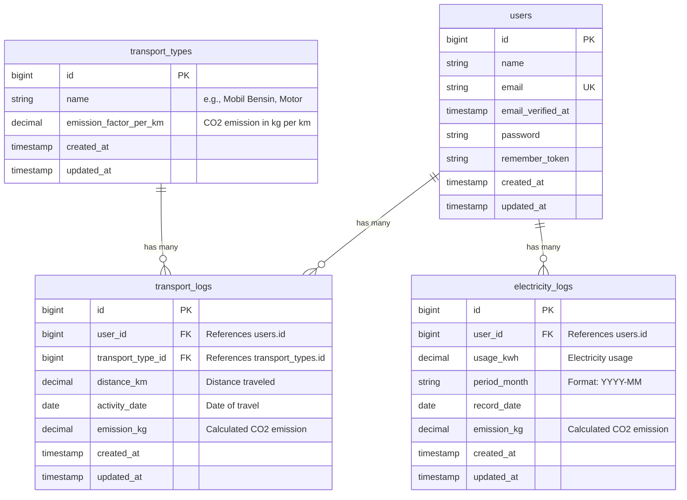

# Database Schema & Entity Relationship Diagram (ERD)

Dokumen ini berisi struktur database untuk EcoTrack Backend.

## Entity Relationship Diagram (ERD)

## Deskripsi Tabel

### 1. `users`
Tabel master untuk menyimpan data pengguna terdaftar. Autentikasi dilakukan menggunakan Laravel Sanctum.
- `id`: Primary Key.
- `name`, `email`, `password`: Kredensial dasar.

### 2. `transport_types`
Tabel referensi (lookup) untuk jenis kendaraan dan faktor emisi spesifiknya.
- `name`: Nama kendaraan (Mobil Bensin, Motor, Bus, KRL, dll).
- `emission_factor_per_km`: Nilai faktor pengali emisi (kg CO₂ / km).

### 3. `transport_logs`
Tabel pencatatan riwayat perjalanan pengguna.
- `user_id`: Foreign key ke tabel `users`.
- `transport_type_id`: Foreign key ke tabel `transport_types`.
- `distance_km`: Jarak tempuh dalam kilometer.
- `emission_kg`: Hasil kalkulasi emisi otomatis oleh `EmissionCalculatorService` di backend.

### 4. `electricity_logs`
Tabel pencatatan konsumsi listrik bulanan pengguna.
- `user_id`: Foreign key ke tabel `users`.
- `usage_kwh`: Total kWh yang digunakan.
- `period_month`: Bulan pencatatan (format YYYY-MM).
- `emission_kg`: Hasil kalkulasi otomatis berdasarkan kWh dikali faktor emisi rata-rata.
